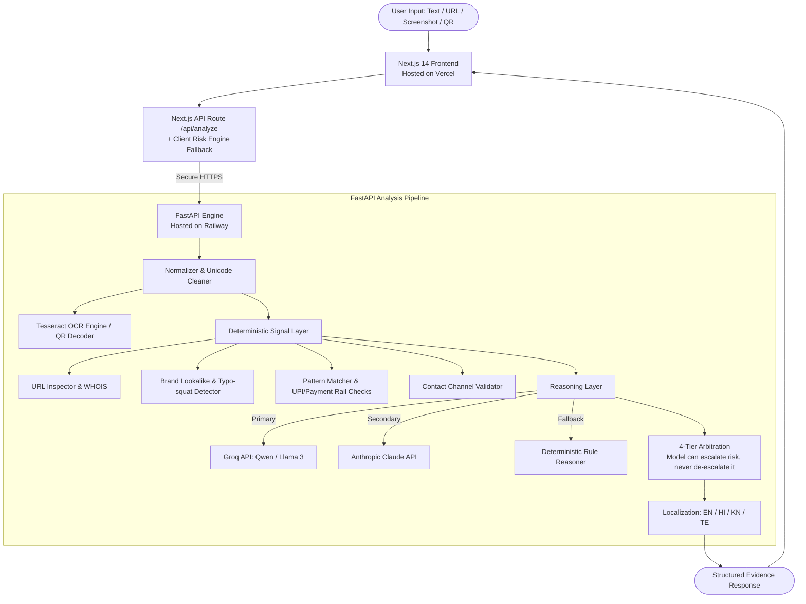

# 🛡️ Digital Safety Co-pilot (Sudarshan Kavach)

[](https://nextjs.org/)
[](https://fastapi.tiangolo.com/)
[](https://sudarshan-kavach.vercel.app)
[](https://sudarshan-kavach.up.railway.app)
[](#-why-digital-safety-co-pilot-is-different)
[](#-privacy--security)

An explainable, evidence-first digital safety assistant. It tells people **why** a message, URL, or screenshot looks dangerous — not just a black-box verdict.

Paste a suspicious SMS, WhatsApp message, UPI collect request, banking alert, email, or screenshot. Get an immediate risk classification, the exact warning signs quoted from your message, a plain-language explanation, and next steps — in **English, Hindi (हिंदी), Kannada (ಕನ್ನಡ), or Telugu (తెలుగు)**.

> *Before you Click, Pay, Share, or Trust — Check with your Digital Safety Co-pilot.*

**Team Hayagreeva** · YUKTIMANTHAN 2.0 Hackathon

---

## 🌟 Why Digital Safety Co-pilot is Different

Existing fraud checkers return a binary label — "safe" or "unsafe" — and stop there. That doesn't help someone who just received an urgent SMS claiming their bank account will be blocked tonight and has no way to evaluate whether that's true.

Our output is structured as evidence, not a verdict:

```
Risk Level → Detected Warning Signs (quoted from your input) → Plain Explanation → Recommended Action
```

1. **Evidence over verdict.** Every warning sign quotes the exact triggering text, domain, or pattern from the input. No signal exists without a citable source.
2. **An honest uncertainty tier.** Four tiers — **Safe**, **Suspicious**, **Dangerous**, and **Cannot Determine**. When evidence is conflicting or thin, the system says so and gives a manual verification checklist instead of guessing.
3. **Regional language, not just translation.** Risk explanations, warning signs, and safety guidance are generated natively in Indic languages — reporting numbers and portal links are hard-coded per language, never machine-translated on the fly.
4. **Resilient by design.** Fast reasoning via the Groq API, with a secondary Anthropic Claude integration and a fully offline deterministic rule engine as fallback if AI calls fail or time out. A network problem during a live demo degrades gracefully instead of erroring out.

---

## 🏗️ System Architecture



> **Reasoning Redundancy:** The pipeline utilizes Groq (`qwen/qwen3.8-27b`) as its ultra-fast primary reasoning provider, with native fallback support for Anthropic Claude (`anthropic_reasoner.py`), and a zero-dependency deterministic rule reasoner ensuring 100% offline uptime even if external APIs are unreachable.

---

## 🚀 Production Deployment

- **Frontend**: Vercel (Global Edge CDN, Next.js App Router) ➔ [https://sudarshan-kavach.vercel.app](https://sudarshan-kavach.vercel.app)
- **Backend**: Railway (Containerized FastAPI service) ➔ [https://sudarshan-kavach.up.railway.app](https://sudarshan-kavach.up.railway.app)

### 1. Backend Deployment on Railway

1. Create a Railway project, choose **Deploy from GitHub repo**, select this repository.
2. Set **Root Directory** to `backend`. Railway detects `backend/Dockerfile` and `backend/railway.toml` automatically.
3. Set environment variables:

   | Variable | Value / Description | Required? |
   |---|---|---|
   | `PORT` | Set automatically by Railway | No |
   | `CORS_ORIGINS` | `https://sudarshan-kavach.vercel.app` | Yes |
   | `GROQ_API_KEY` | Your Groq API key | Yes |
   | `GROQ_MODEL` | `qwen/qwen3.8-27b`  | Yes |
   | `ANTHROPIC_API_KEY` | Your Anthropic Claude API key (optional fallback) | No |
   | `ENVIRONMENT` | `production` | Recommended |

4. Verify health at `https://sudarshan-kavach.up.railway.app/api/v1/health`.

### 2. Frontend Deployment on Vercel

1. Import the repository, set **Root Directory** to `frontend`.
2. Framework preset: Next.js. Build command and output directory: defaults.
3. Set environment variables:

   | Variable | Value | Description |
   |---|---|---|
   | `BACKEND_URL` | `https://sudarshan-kavach.up.railway.app` | Points frontend to the Railway backend |
   | `NEXT_PUBLIC_APP_URL` | `https://sudarshan-kavach.vercel.app` | Canonical URL for metadata & sharing |

4. Deploy. Production domain: `https://sudarshan-kavach.vercel.app`.

---

## 💻 Local Development Quickstart

### Prerequisites
- Node.js 18+ and npm
- Python 3.14
- Tesseract OCR (for screenshot analysis)

### 1. Clone

```bash
# GitHub Repository
git clone https://github.com/satvikpandurangi/Sudarshan-Kavach.git
cd Sudarshan-Kavach

# Hackathon Mirror
# git clone https://github.com/Udyoga-Pramoda-Hackathon-2026/team-hayagreeva.git
```

### 2. Backend (FastAPI)

```bash
cd backend
python -m venv .venv

# Windows (PowerShell):
.\.venv\Scripts\Activate.ps1
# Linux / macOS:
# source .venv/bin/activate

pip install -r requirements.txt
cp .env.example .env

uvicorn app.main:app --reload --host 127.0.0.1 --port 8000
```

Verify: [http://127.0.0.1:8000/api/v1/health](http://127.0.0.1:8000/api/v1/health)

### 3. Frontend (Next.js)

```bash
cd frontend
npm install
cp .env.example .env.local
npm run dev
```

Open [http://localhost:3000](http://localhost:3000).

---

## 🧪 Testing and Evaluation

```bash
cd backend
.\.venv\Scripts\python.exe -m pytest -q
```

Automated tests cover:
- **Grounding**: every signal's evidence field must be a literal substring of the input — no invented citations.
- **Escalate-never-de-escalate**: the reasoning layer can raise a risk tier above what the deterministic signals indicate, but can never lower one. Tested directly, not just through the full pipeline.
- **Brand lookalike detection**: SBI, HDFC, ICICI, India Post, electricity boards, and major payment brands.
- **UPI and payment-rail patterns**: collect-request traps, reversal scams, advance-fee patterns.
- **OCR degradation**: screenshots below the OCR confidence floor return `Cannot Determine` rather than a confident wrong answer.

Separately, `eval/` runs the accuracy benchmark against a hand-collected dataset of real scam and legitimate messages (50/50 split — legitimate messages are weighted equally because a tool that flags everything scores high on detection alone). Run `npm run eval` and `npm run eval:baseline` to reproduce current numbers.

---

## 📁 Repository Structure

```
Sudarshan-Kavach/
├── backend/                        # FastAPI service (Railway)
│   ├── app/
│   │   ├── main.py                 # Endpoints & CORS configuration
│   │   ├── schemas.py              # Pydantic request/response models
│   │   └── pipeline/
│   │       ├── analyzer.py         # Orchestrates the full analysis pipeline
│   │       ├── arbitration.py      # 4-tier decision & escalate-only guardrail
│   │       ├── domain_age.py       # WHOIS resolution (with mock mode)
│   │       ├── groq_reasoner.py    # Primary reasoning via Groq
│   │       ├── anthropic_reasoner.py # Secondary reasoning via Anthropic
│   │       ├── localization.py     # EN / HI / KN / TE generation
│   │       ├── ocr.py              # Tesseract screenshot integration
│   │       ├── reasoning.py        # Abstract reasoner + deterministic fallback
│   │       └── signals/            # URL, brand, pattern & channel detectors
│   ├── tests/                      # pytest suite
│   ├── eval/                       # Python evaluation harness & dataset
│   ├── Dockerfile
│   ├── railway.toml
│   └── requirements.txt
│
├── frontend/                       # Next.js 14 (Vercel)
│   ├── app/
│   │   ├── page.tsx                # Hero, quick scan, feature highlights
│   │   ├── check/page.tsx          # Interactive scanner (text / URL / image / QR)
│   │   ├── dashboard/page.tsx      # Threat intelligence analytics & stats
│   │   ├── safety/page.tsx         # Golden Hour flow & recovery playbooks
│   │   ├── history/page.tsx        # Client-side encrypted history
│   │   ├── api/analyze/route.ts    # Backend proxy & client risk-engine fallback
│   │   └── layout.tsx
│   ├── components/                 # UI components (Checker, ThreatGauge, Header, etc.)
│   ├── lib/                        # Risk display helpers, WhatsApp share, URL parsing
│   └── vercel.json
│
├── eval/                           # Cross-platform Node evaluation harness
│   ├── run.js                      # Evaluator entrypoint
│   └── dataset.csv                 # Evaluation benchmark dataset
│
├── docs/                           # Architecture & engineering specs
│   ├── architecture.md
│   ├── api-spec.md
│   ├── detection-approach.md
│   ├── evaluation.md
│   ├── false-positives.md
│   └── scope.md
│
├── Artifacts/                      # Hackathon submissions & presentation materials
│   ├── YM Part 1 Artifacts/        # Documentation & challenge files
│   └── YM Part 2 Artifacts/        # Team Hayagreeva Ideation & Planning .pptx
│
└── README.md
```

> 🔒 **Zero-Database Architecture:** Submitted messages, URLs, and screenshots are processed purely in-memory and discarded immediately after response assembly. Check history shown in the UI is stored strictly on the user's client device (`localStorage`).

---

## 🔒 Privacy & Security

1. **No content storage.** Submitted messages, URLs, and screenshots are analyzed in memory and discarded after the response is returned. Check history shown in the UI lives in the browser only.
2. **Links are never opened.** URLs are inspected structurally — domain age, character homoglyphs, TLD reputation — never crawled or executed.
3. **Reporting details are never AI-generated.** The national helpline (1930) and cybercrime.gov.in are hard-coded per language, not produced by the model, to remove any risk of a hallucinated number.
4. **Sharing is device-native.** The "share this result" action opens the user's own WhatsApp via a `wa.me` link. We never see or store the recipient's contact information — WhatsApp's own picker handles it entirely on-device.

---

## 👥 Team Hayagreeva

Built for **YUKTIMANTHAN 2.0**:
- Prateek Deshpande 
- Adithi D S
- K Aasritha Vardhan
- Satvik Pandurangi


## 📄 License

[MIT License](LICENSE)
