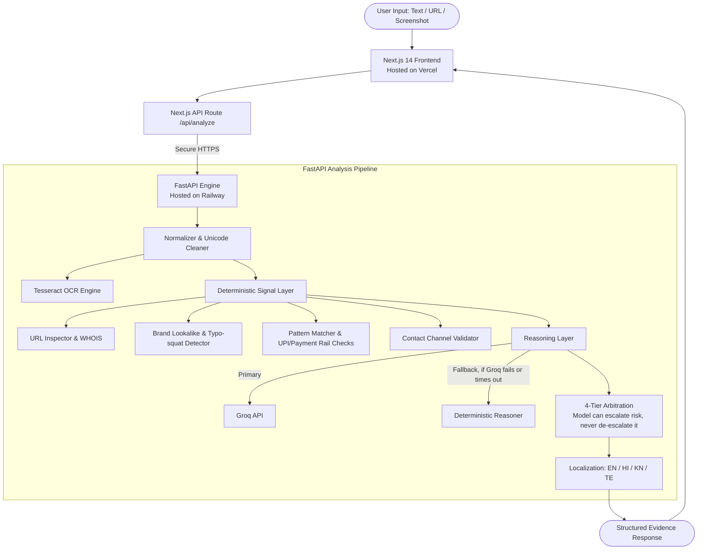

# 🛡️ Digital Safety Co-pilot (Sudarshan Kavach)

[](https://nextjs.org/)
[](https://fastapi.tiangolo.com/)
[](https://vercel.com)
[](https://railway.app)
[](#-multilingual-support)
[](#-privacy--security-invariants)

An explainable, evidence-first digital safety assistant. It tells people **why** a message, URL, or screenshot looks dangerous — not just a black-box verdict.

Paste a suspicious SMS, WhatsApp message, UPI collect request, banking alert, email, or screenshot. Get an immediate risk classification, the exact warning signs quoted from your message, a plain-language explanation, and next steps — in **English, Hindi (हिंदी), Kannada (ಕನ್ನಡ), or Telugu (తెలుగు)**.

> *Before you Click, Pay, Share, or Trust — Check with your Digital Safety Co-pilot.*

**Team Hayagreeva** · YUKTIMANTHAN 2.0 Hackathon

---

## 🌟 Why Digital Safety Co-pilot is Different

Existing fraud checkers return a binary label — "safe" or "unsafe" — and stop there. That doesn't help someone who just received an urgent SMS claiming their bank account will be blocked tonight and has no way to evaluate whether that's true.

Our output is structured as evidence, not a verdict:

```
Risk Level → Detected Warning Signs (quoted from your input) → Plain Explanation → Recommended Action
```

1. **Evidence over verdict.** Every warning sign quotes the exact triggering text, domain, or pattern from the input. No signal exists without a citable source.
2. **An honest uncertainty tier.** Four tiers — **Safe**, **Suspicious**, **Dangerous**, and **Cannot Determine**. When evidence is conflicting or thin, the system says so and gives a manual verification checklist instead of guessing.
3. **Regional language, not just translation.** Risk explanations, warning signs, and safety guidance are generated natively in Indic languages — reporting numbers and portal links are hard-coded per language, never machine-translated on the fly.
4. **Resilient by design.** Fast reasoning via the Groq API, with a fully offline deterministic rule engine as fallback if the AI call fails or times out. A network problem during a live demo degrades gracefully instead of erroring out.

---

## 🏗️ System Architecture



> ⚠️ **Before submission:** confirm whether `anthropic_reasoner.py` is an active second reasoning path or leftover from an earlier experiment. If it's active, add it to this diagram and to the cost/architecture description below — don't leave a component undocumented that a judge could find in the repo.

---

## 🚀 Production Deployment

- **Frontend**: Vercel (global CDN, Next.js App Router)
- **Backend**: Railway (containerized, doesn't sleep on inactivity — important for a live demo)

### 1. Backend Deployment on Railway

1. Create a Railway project, choose **Deploy from GitHub repo**, select this repository.
2. Set **Root Directory** to `backend`. Railway detects `backend/Dockerfile` and `backend/railway.toml` automatically.
3. Set environment variables:

   | Variable | Value / Description | Required? |
   |---|---|---|
   | `PORT` | Set automatically by Railway | No |
   | `CORS_ORIGINS` | Your exact Vercel URL, e.g. `https://your-app.vercel.app` — **not** `*` | Yes |
   | `GROQ_API_KEY` | Your Groq API key | Yes |
   | `GROQ_MODEL` | See note below | Yes |
   | `ENVIRONMENT` | `production` | Recommended |

   > ⚠️ **Verify `GROQ_MODEL` against Groq's current model list before deploying.** A model string that no longer exists fails silently into degraded mode on every request — you'd only find out live.

   > `CORS_ORIGINS=*` accepts requests from any origin, including a spoofed frontend. Lock it to your real deployed URL.

4. Generate a domain and verify health at `https://your-backend.up.railway.app/api/v1/health`.

### 2. Frontend Deployment on Vercel

1. Import the repository, set **Root Directory** to `frontend`.
2. Framework preset: Next.js. Build command and output directory: defaults.
3. Set environment variables:

   | Variable | Value | Description |
   |---|---|---|
   | `BACKEND_URL` | `https://your-backend.up.railway.app` | Points the frontend at the Railway backend |
   | `NEXT_PUBLIC_APP_URL` | `https://your-app.vercel.app` | Canonical URL for metadata |

4. Deploy.

---

## 💻 Local Development Quickstart

### Prerequisites
- Node.js 18+ and npm
- Python 3.10+ (tested on 3.11 / 3.12)
- Tesseract OCR (for screenshot analysis)

### 1. Clone

```bash
git clone https://github.com/satvikpandurangi/digital-safety-co-pilot.git
cd digital-safety-co-pilot
```

### 2. Backend (FastAPI)

```bash
cd backend
python -m venv .venv

# Windows (PowerShell):
.\.venv\Scripts\Activate.ps1
# Linux / macOS:
# source .venv/bin/activate

pip install -r requirements.txt
cp .env.example .env

uvicorn app.main:app --reload --host 127.0.0.1 --port 8000
```

Verify: [http://127.0.0.1:8000/api/v1/health](http://127.0.0.1:8000/api/v1/health)

### 3. Frontend (Next.js)

```bash
cd frontend
npm install
cp .env.example .env.local
npm run dev
```

Open [http://localhost:3000](http://localhost:3000).

---

## 🧪 Testing and Evaluation

```bash
cd backend
.\.venv\Scripts\python.exe -m pytest -q
```

Automated tests cover:
- **Grounding**: every signal's evidence field must be a literal substring of the input — no invented citations.
- **Escalate-never-de-escalate**: the reasoning layer can raise a risk tier above what the deterministic signals indicate, but can never lower one. Tested directly, not just through the full pipeline.
- **Brand lookalike detection**: SBI, HDFC, ICICI, India Post, electricity boards, and major payment brands.
- **UPI and payment-rail patterns**: collect-request traps, reversal scams, advance-fee patterns.
- **OCR degradation**: screenshots below the OCR confidence floor return `Cannot Determine` rather than a confident wrong answer.

Separately, `eval/` runs the accuracy benchmark against a hand-collected dataset of real scam and legitimate messages (50/50 split — legitimate messages are weighted equally because a tool that flags everything scores high on detection alone). Run `npm run eval` and `npm run eval:baseline` to reproduce current numbers.

> ⚠️ **This repo currently has two eval systems** — `backend/eval/` (Python) and a root-level `eval/` (Node). Confirm which one is current and remove the other before submission; two dataset files that can silently diverge is worse than picking one.

---

## 📁 Repository Structure

```
digital-safety-co-pilot/
├── backend/                        # FastAPI service (Railway)
│   ├── app/
│   │   ├── main.py                 # Endpoints & CORS configuration
│   │   ├── schemas.py              # Pydantic request/response models
│   │   └── pipeline/
│   │       ├── analyzer.py         # Orchestrates the full analysis pipeline
│   │       ├── arbitration.py      # 4-tier decision & escalate-only guardrail
│   │       ├── domain_age.py       # WHOIS resolution (with mock mode)
│   │       ├── groq_reasoner.py    # Primary reasoning via Groq
│   │       ├── localization.py     # EN / HI / KN / TE generation
│   │       ├── ocr.py              # Tesseract screenshot integration
│   │       ├── reasoning.py        # Abstract reasoner + deterministic fallback
│   │       └── signals/            # URL, brand, pattern & channel detectors
│   ├── tests/                      # pytest suite
│   ├── eval/                       # Evaluation harness & dataset (see note above)
│   ├── Dockerfile
│   ├── railway.toml
│   └── requirements.txt
│
├── frontend/                       # Next.js 14 (Vercel)
│   ├── app/
│   │   ├── page.tsx                # Hero, quick scan, feature highlights
│   │   ├── check/page.tsx          # Interactive scanner (text / URL / image / QR)
│   │   ├── safety/page.tsx         # Golden Hour flow & recovery playbooks
│   │   ├── api/analyze/route.ts    # Backend proxy
│   │   └── layout.tsx
│   ├── components/
│   ├── lib/                        # Risk display helpers, WhatsApp share, URL parsing
│   └── vercel.json
│
├── docs/                           # Architecture & engineering specs
│   ├── architecture.md
│   ├── api-spec.md
│   ├── detection-approach.md
│   ├── evaluation.md
│   ├── false-positives.md
│   └── scope.md
│
└── README.md
```

> ⚠️ **`frontend/prisma/schema.prisma` was present in the original repo listing.** If it's unused starter-template scaffolding, delete it before submission — an unused database schema sitting next to a "we store nothing" claim is exactly the kind of thing a technical judge checks. If it's actually wired up, the privacy section below needs to change to match reality.

---

## 🔒 Privacy & Security

1. **No content storage.** Submitted messages, URLs, and screenshots are analyzed in memory and discarded after the response is returned. Check history shown in the UI lives in the browser only.
2. **Links are never opened.** URLs are inspected structurally — domain age, character homoglyphs, TLD reputation — never crawled or executed.
3. **Reporting details are never AI-generated.** The national helpline (1930) and cybercrime.gov.in are hard-coded per language, not produced by the model, to remove any risk of a hallucinated number.
4. **Sharing is device-native.** The "share this result" action opens the user's own WhatsApp via a `wa.me` link. We never see or store the recipient's contact information — WhatsApp's own picker handles it entirely on-device.

---

## 👥 Team Hayagreeva

Built for **YUKTIMANTHAN 2.0**:
- Satvik Pandurangi
- Aditi
- K Vardhan
- Prateek Deshpande

## 📄 License

[MIT License](LICENSE)
